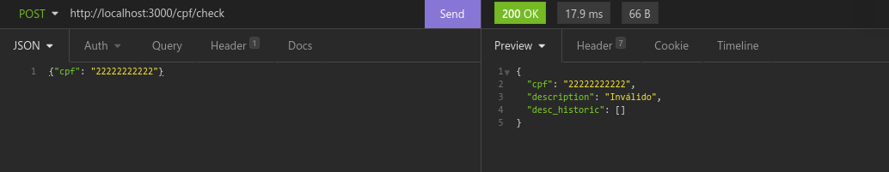
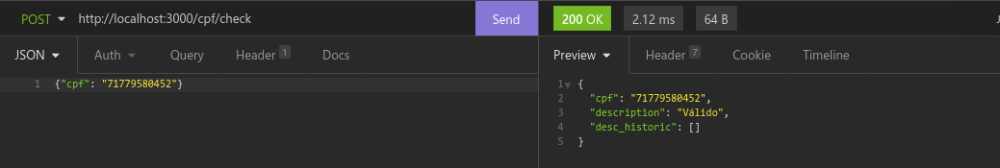
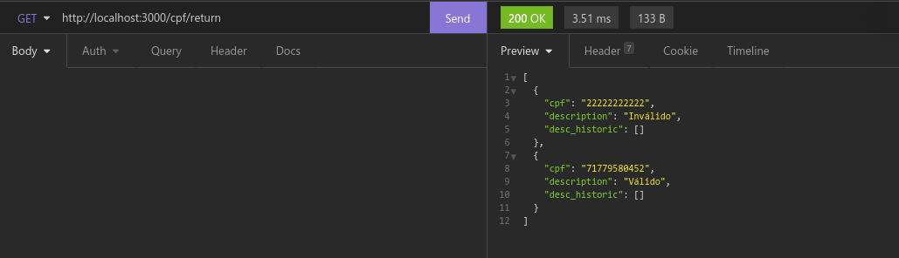
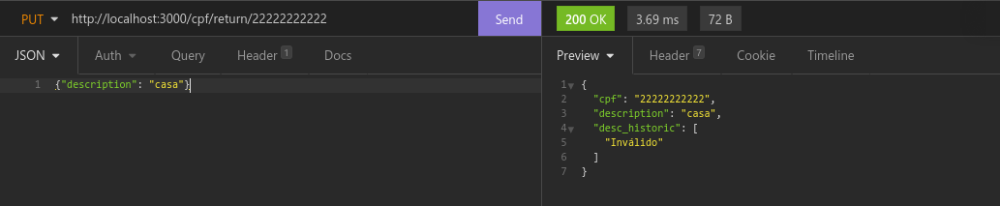
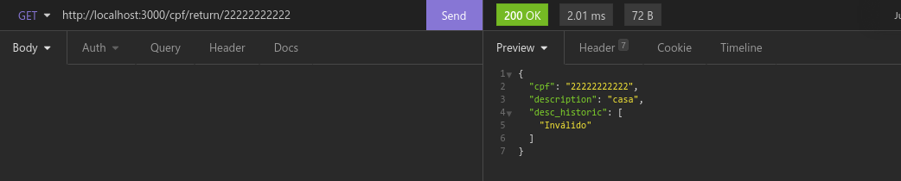
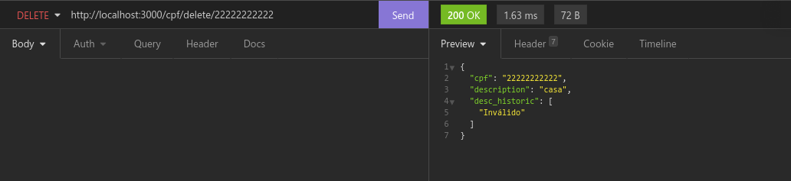
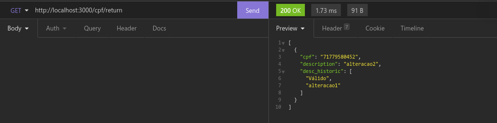

# Atividade - API NodeJS
#### Por: Paulo Henrique Abreu Paulo

 

## Descrição

Olá pessoal, para essa atividade deve ser desenvolvida uma API com NodeJS usando express ou NestJS, com as seguintes endpoints e funcionalidades:

Esta api deve ser um serviço que verifica CPFs, por trás dos números do cpf existe uma logica matemática que deve ser implementada ou podem pegar algo já pronta na internet para isso. O objetivo da aplicação é que seja possível enviar o numero do CPF e esse CPF ser classificado como valido ou 

invalido, além disso para cada consulta deve-se armazenar em memoria com array de objetos ou no banco de dados como preferirem, o histórico com 2 atributos: CPF e Descrition, por padrão a description pode ser 'valido' ou 'invalido', mas pode ser alterado com a endpoint de update. Deve ser possível lista todo o histórico ou filtra pelo cpf, deve ser possível apagar todo histórico de um determinado CPF.

 

----
Post - {base_url}/cpf/check/ {cpf: '10238473723'}

Get - {base_url}/cpf/return/

Get - {base_url}/cpf/return/:cpf

Delete - {base_url}/cpf/delete/:cpf

Put - {base_url}/cpf/update/:cpf {description: 'test'}

----

 

Enviem o código de preferencia para o gihub e postem aqui só o link ou um arquivo de texto com o link e mais alguma descrição que achem necessário, caso não consigam mandar para o gihub podem mandar o código em zip, mas lembrem de apagar a parte node_modules.

 

----

 

## Execução

Imagens das requisições ao servidor.

 

