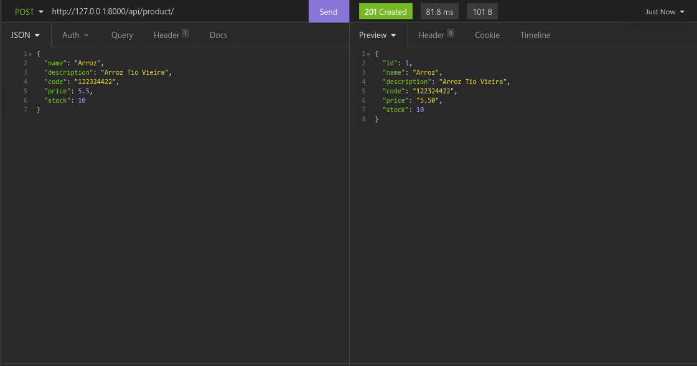
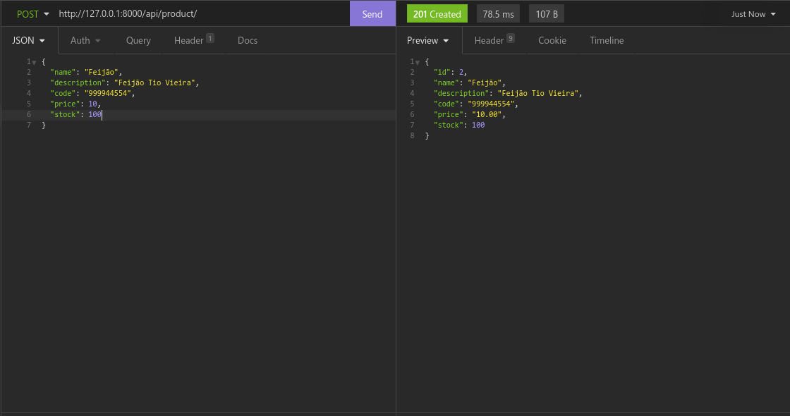
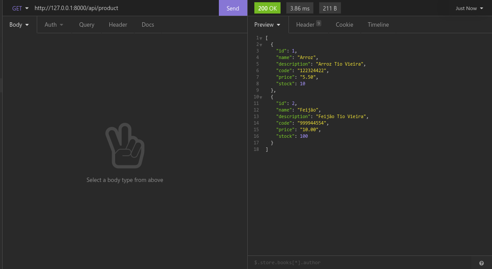
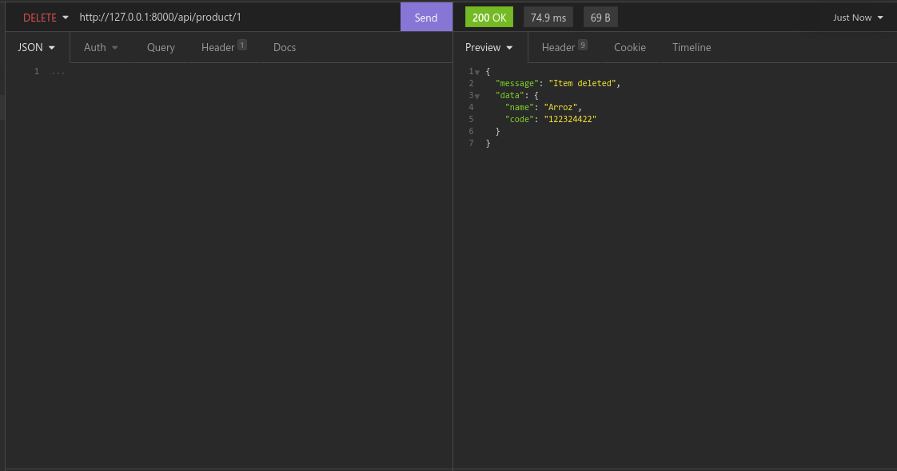
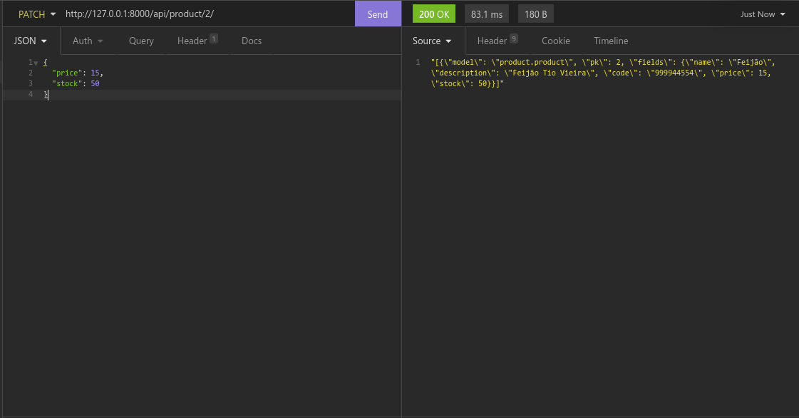
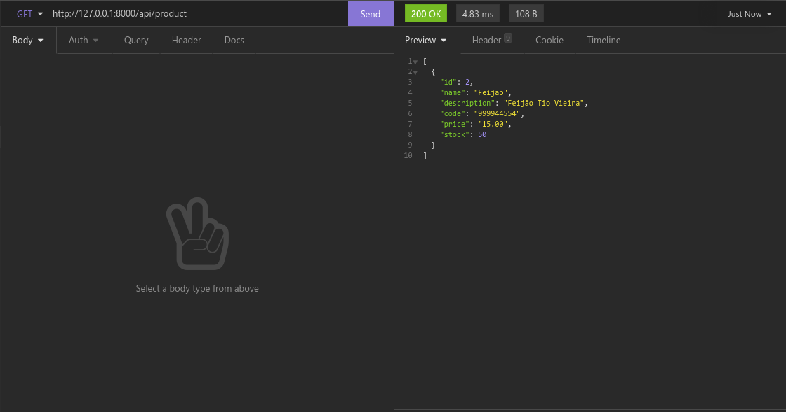

# Projeto Django + Rest API

#### Por: Hélio Adrião e Samuel Araujo Silva

 

## Descrição

- Criar um projeto Django + Rest framework.
- Projeto deve ter ao menos um modelo e o CRUD do mesmo, e sua API.
- Subir o projeto em uma plataforma GIT.
- Submeter o link do projeto na atividade.

## Endpoints

----
POST - {base_url}/product/ 
{
    "name": "Feijão",
	"description": "Feijão Tio Vieira",
    "code": "999944554",
	"price": 10,
	"stock": 100
}

GET - {base_url}/product/

DELETE - {base_url}/product/{id}/

PATCH - {base_url}/product/{id}/ 
{"price": 15, "stock": 50}

----

## Execução

Imagens das requisições.

 

*POST: Inserção de produtos*

 

*GET*

*DELETE*

*PATCH*

*GET*